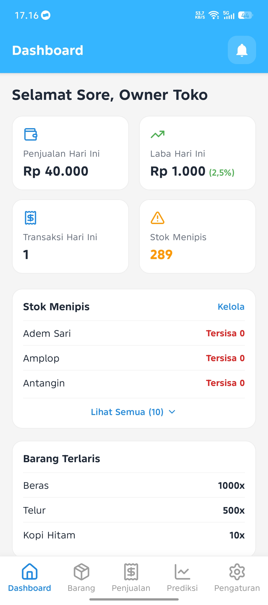
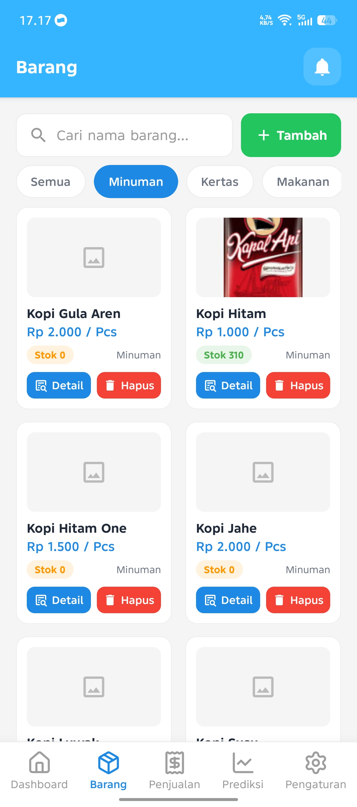
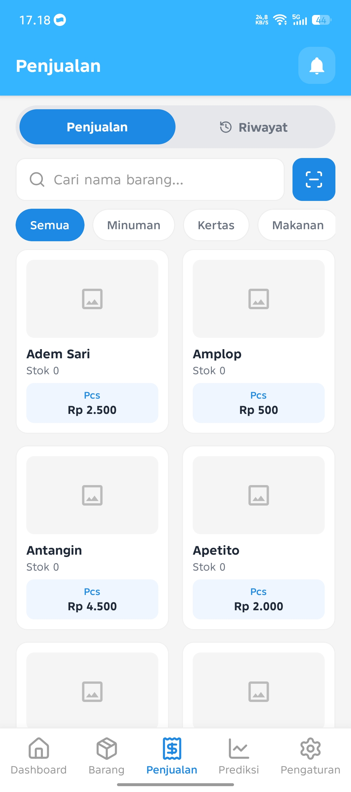
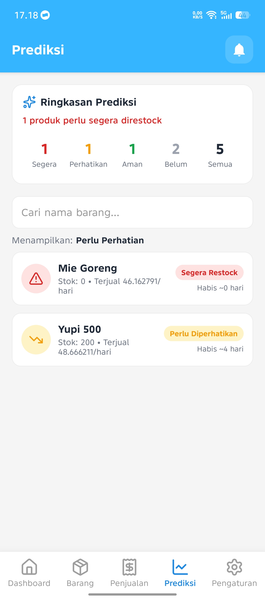
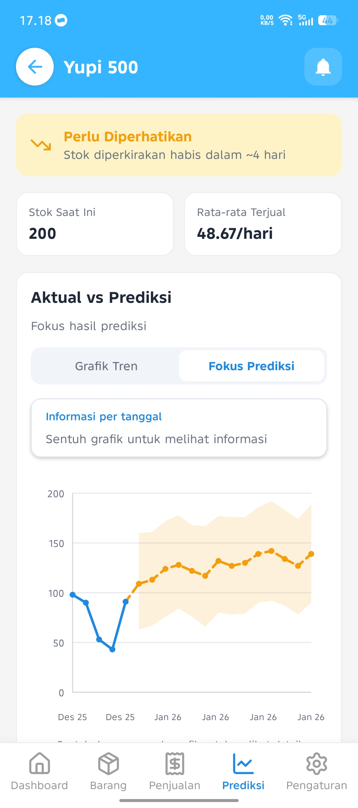
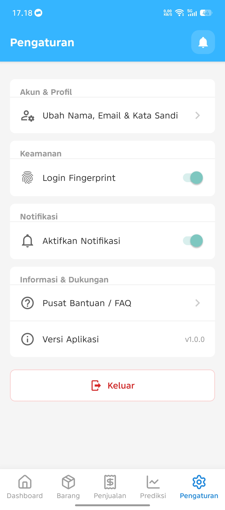

<div align="center">

# 🛒 TokoPrediksi

**Kelola stok, catat penjualan, dan prediksi kebutuhan barang toko Anda — semuanya dari satu aplikasi.**


</div>

---

## Tentang Aplikasi

**TokoPrediksi** adalah aplikasi mobile untuk membantu pemilik toko kelontong mengelola inventori sekaligus merencanakan restok dengan lebih cerdas. Selain mencatat stok, pembelian, dan penjualan harian, aplikasi ini memakai **Facebook Prophet** untuk memprediksi penjualan produk unggulan sehingga pemilik toko tahu kapan stok akan menipis sebelum kehabisan.

> Dikembangkan sebagai proyek tugas akhir (skripsi).

## Fitur Unggulan

- 📦 **Manajemen barang** — multi-satuan (kg, pcs, dus, dll), kategori, foto, dan barcode scanner
- 🧾 **Kasir (POS)** — transaksi cepat dengan pilihan satuan, diskon, dan riwayat penjualan
- 🚚 **Pembelian & stok FIFO** — pelacakan batch dan tanggal kedaluwarsa
- 📈 **Prediksi penjualan** — grafik perkiraan permintaan beserta rekomendasi pembelian
- 🔔 **Notifikasi stok menipis** — otomatis lewat job prediksi mingguan dan push notification
- 🔐 **Aman** — login JWT, reset password via OTP, dan login biometrik

## Tangkapan Layar

<div align="center">

|                        Dashboard                         |                        Barang                         |                        Penjualan                         |
| :------------------------------------------------------: | :---------------------------------------------------: | :------------------------------------------------------: |
|  |  |  |

|                        Prediksi                         |                        Detail Prediksi                         |                        Pengaturan                         |
| :-----------------------------------------------------: | :------------------------------------------------------------: | :-------------------------------------------------------: |
|  |  |  |

</div>

## Bagaimana Cara Kerjanya

```
📱 Aplikasi React Native  ─►  ⚙️ Backend Go + MySQL  ─►  🔮 Layanan Prediksi (Python + Prophet)
```

Aplikasi mobile berkomunikasi dengan backend Go yang mengelola data dan bisnis logika. Saat prediksi dibutuhkan, backend mengirim riwayat penjualan harian ke layanan Python, yang mengembalikan perkiraan permintaan beserta rentang ketidakpastiannya.

## Teknologi

|                       |                                      |
| --------------------- | ------------------------------------ |
| **Mobile**            | React Native, React Navigation       |
| **Backend**           | Go, Gin, GORM, MySQL                 |
| **Prediksi**          | Python, FastAPI, Prophet             |
| **Layanan pendukung** | Cloudinary, Brevo SMTP, Firebase FCM |

---

<div align="center">

Dibuat oleh **mfthfarid** · Proyek Skripsi

</div>
